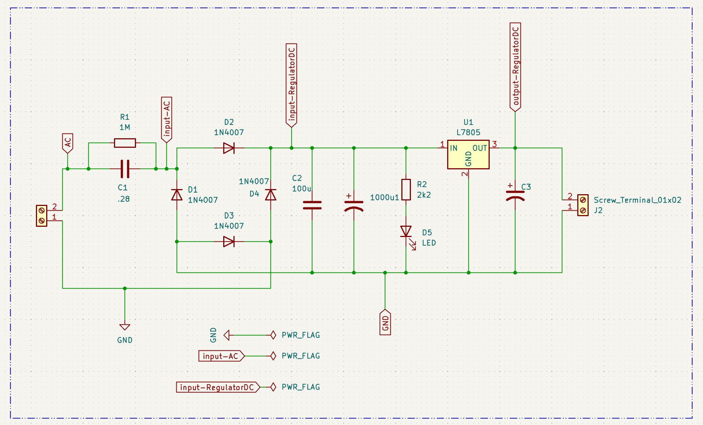
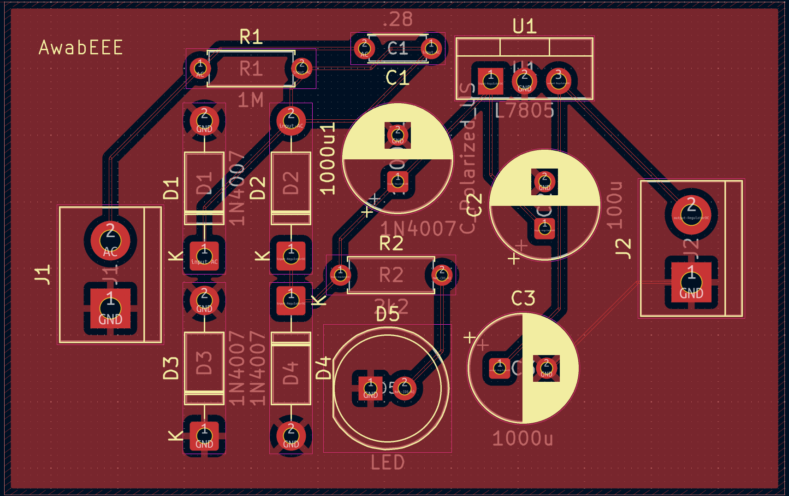
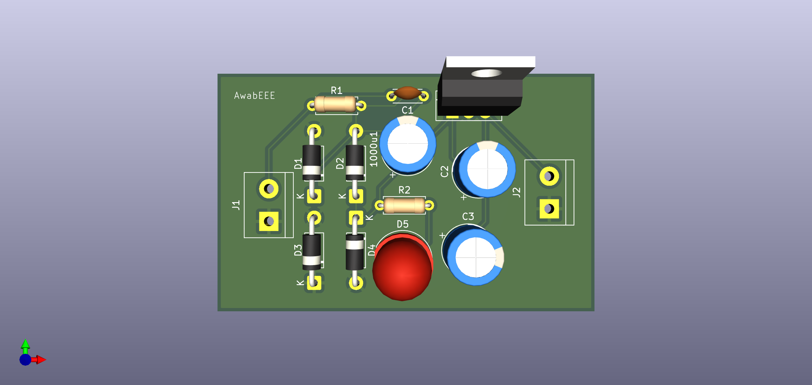
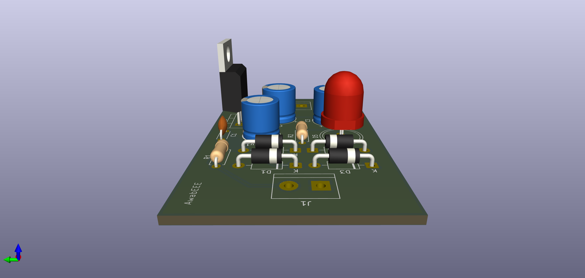

### Capacitive Dropper with L7805 
a capacitive dropper AC-to-DC power supply based on the L7805 linear regulator. The design safely steps down mains AC using an X-rated capacitor, rectifier, filtering, and then regulates to a stable 5V DC.

### Repository Contents :
kicad_sch – KiCad schematic 
kicad_pcb – KiCad PCB layout
 
 

### 🛠️ Tools Used
KiCad (v9.03)

🖼️ Previews
### **Schematic** :

 
### Circuit Explanation
This circuit is a capacitive dropper type power supply: 
AC Input → Connected to mains (high voltage, dangerous). 
X-rated Capacitor + Resistor → Limits AC current without dissipating much heat (capacitive reactance acts as a "resistor"). The series resistor also helps limit inrush current and improves safety.
 
Rectifier → Diodes convert AC to pulsating DC. 
Smoothing Capacitor → Provides a DC rail with ripple removed. 
L7805 Regulator → Provides a stable +5V output for low-power electronics. 
Bypass Capacitors → On regulator input and output for stability. 
Load Output → Clean, regulated +5V DC. 
 
 
###  Important Note: A capacitive dropper has no galvanic isolation from mains. It should only be used for low-power embedded circuits in fully enclosed designs where safety is guaranteed.
 
 

### **PCB** :

  
  

 
 

## 📜 License
This project is licensed under [CC0 1.0](https://creativecommons.org/publicdomain/zero/1.0/),  
which dedicates it to the public domain.

### ✨ Author
Awab– @AwabEEE
